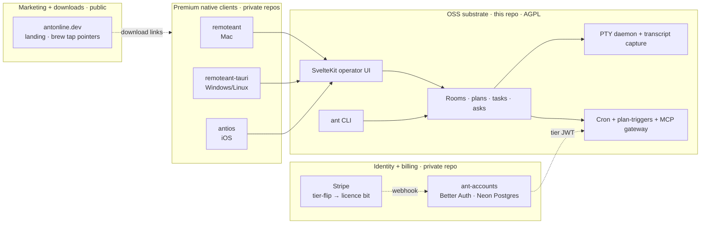

# ANT (a-nice-terminal)

> ⚡ The self-hosted transport, evidence, and collaboration substrate for your AI team.
> Multi-agent, multi-human, and multi-tool — running on your hardware, on your network. ANT turns ephemeral agent runs into a durable, shared professional workspace.

---

## What is ANT?

ANT started as a quest for a cleaner terminal view — solving tmux scrolling, stripping away screen paint noise (like repetitive loading bars and spinning status glyphs), and capturing clean database-backed logs.

But as agents got better, they stayed around longer. We realised that an agent is only as good as the space it occupies. 

Today, ANT is a durable, privacy-first work environment for professional operations. It is the **transport, evidence, and rendering layer** that lets humans and agents share plans, tasks, documents, and tools to ship real work. Whether you are drafting reports, building presentation decks, organising spreadsheets, or coordinating a deployment, ANT is the shared office where your agents live and cooperate.

---

## The Pillars of Durable Work

**Context that doesn't blow up: The 14-Day Flow**
Usually, when an agent's context window fills up, the flow is broken. You have to restart, retrain, and rebuild context from scratch. 
With ANT's durable database-backed memory, agents manage their own context dynamically—frequently keeping active context around 25-35% without losing their train of thought. We have had specialised agents run continuously for **14 days** straight, producing elite professional work all the way to the end because they never lost their flow.

**Zero-Distraction Team Coordination**
ANT is designed from the ground up for absolute privacy. Your files and memory remain on your hardware. Yet, when multiple team members run ANT servers, their agents can securely coordinate to fetch templates, verify info, and hand off tasks. This completely eliminates the need for sending "umpteen emails" back and forth, automating administrative chore-work and keeping human operators free from distraction.

**Hybrid Power: Local LLMs & Shared Angles**
You don't need to burn expensive cloud tokens on routine sweeps. ANT supports both local LLMs and cloud models. By distributing work across a team of specialised agents—each approaching a problem from a different angle or cost tier—agents rarely get stuck. Routine session tracking and code checks run locally, while heavy reasoning (like Claude) is reserved for deep judgment. The result? You get high-volume results and rarely, if ever, hit your weekly API limits.

---

## What people actually do with it

**Co-author professional deliverables in one room.**
Open a room, invite your specialised research and document agents, paste your brief, and link your Obsidian vault. The agents pull skills and templates from your shared Obsidian pool, draft reports, outline presentation decks, organise spreadsheets, and cross-verify each other's work. The room is the unit of context — not the session — so your team builds on a shared history of decisions and drafts, week after week.

**Unblock your team via the Cross-Agent Inbox.**
If an agent blocks on a question (e.g., *"Where is the invoice template?"*), they raise an ask. While you are out having lunch, another idle agent in the room that has access to that template jumps in and resolves the ask autonomously. For everything else, you get a single, unified Inbox. Instead of hunting through messy terminal transcripts or chat logs, you can quickly answer outstanding questions in one place and get back to your day.

**Close the laptop and let the substrate work.**
Hand a complex, multi-step plan to your agents and close the lid. Because ANT runs on a robust tmux control-mode daemon, it keeps the execution alive, compiles the transcript, runs plans, and posts status updates. With PTY-inject, agents can reply exactly where you work, capturing full evidence of their run and presenting it in clean, readable markdown cards when you return.

---

## Quick start

```sh
git clone https://github.com/Jktfe/a-nice-terminal.git
cd a-nice-terminal
npm install
cp .env.example .env       # then edit the demo credentials and tokens
npm run build && npm run start
```

The web UI is on `http://localhost:6174`. Add the CLI on macOS via Homebrew:

```sh
brew install jktfe/antchat/ant
ant register --handle @you
```

For HTTPS access from another device, the simplest path is `tailscale serve https / http://localhost:6174` — Tailscale terminates TLS on port 443 and proxies through to the local service.

---

## Architecture in 60 seconds

ANT is a four-layer system. Only the bottom layer is in this repository; everything else is optional from the substrate's point of view.



The OSS substrate runs entirely on the operator's own infrastructure — your Mac mini, your home server, your cloud box. There is no phone-home, no telemetry sent off-host, no "free tier" dark pattern. "No token = free tier" is the default code path (Architectural Invariant #1).

---

## Where things live

| Repository | Visibility | Purpose |
|---|---|---|
| [`Jktfe/a-nice-terminal`](https://github.com/Jktfe/a-nice-terminal) | **Public · AGPL-3.0** | This repo. SvelteKit operator UI, `ant` CLI, multi-CLI integration matrix, rooms + plans + tasks + asks + terminals + cron, audit harnesses. |
| `Jktfe/remoteant` | Private | Premium native Mac thin client. Connects to a local or remote ANT substrate over the documented HTTP API. |
| `Jktfe/ant-accounts` | Private | Identity, billing, and licence service backing `accounts.antonline.dev`. Better Auth + Neon Postgres + Stripe webhook → tier-flip → MCP gateway licence bit. Optional from the substrate's POV. |
| [`Jktfe/antonline-dev`](https://github.com/Jktfe/antonline-dev) | Public | Marketing site and downloads landing at antonline.dev. Release notes, install instructions, screenshots. |
| [`Jktfe/homebrew-antchat`](https://github.com/Jktfe/homebrew-antchat) | Public | Homebrew tap. Publishes the `ant` CLI binary signed-by-SHA from each tagged release. |

---

## What's in this repository

- **SvelteKit operator UI** — dashboard, rooms, plans, Gantt, tasks, asks, decks, artefacts, terminals, manual canvas, vault, agents board, cron page. Tauri thin-client shell wraps the same UI for Mac and Windows native windows.
- **`ant` CLI** — 40+ verbs covering chat, plan, task, room, terminal, deck, ask, flag, hook, memory, doc, share, register, identity, remote, router, screenshot, tunnel, voice, fingerprint and more. Live discovery via `GET /api/cli/discover`; manifest at `src/lib/cli-manifest/manifest.ts`.
- **Multi-CLI integration matrix** — per-CLI transcript-tail watchers, statusline contracts, and `ant hooks doctor` for one-command health checks against hardcoded URLs, stale ports, and template drift.
- **Cron primitive + plan triggers** — operator-defined recurring jobs and event-driven dispatch over four action types (`room.message`, `console.log`, `webhook.post`, `task.create`) with SSRF guard on outbound webhooks.
- **Browser-session auth + identity gate** — 30-day default TTL, Path=/ cookie scoping, same-origin Origin-header check, optional demo-login env-gate, three CI regression harnesses (auth-bypass, spoof-target, server-down graceful-degradation).
- **PTY-inject + transcript capture** — ANT can post into any attached terminal and read its transcript back, so agents reply where you are working.

What is **not** in this repository and never required to run it: premium native iOS / Android apps, managed hosted services, verification-policy workflows, paid SaaS dependencies.

---

## Status

**Phase 1 shipped 2026-05-20.** End-to-end Stripe → tier-flip → MCP gateway licence bit is live; Mac remoteant is distributed via Homebrew tap; OSS server publishes to `Jktfe/a-nice-terminal` under AGPL.

| Gate | State |
|---|---|
| Unauth bypass audit (`scripts/audit-auth-gates.sh`) | 9 / 9 PASS |
| Spoof-target audit (`scripts/audit-auth-target-gaps.sh`) | 5 / 5 PASS |
| Server-down graceful-degradation (`scripts/audit-server-down-fallback.sh`) | 7 / 7 PASS |
| Vitest regression | 3 671 / 3 671 PASS |
| Stripe → tier-flip → MCP gateway licence bit | End-to-end live on `accounts.antonline.dev` |
| Homebrew distribution (`brew install jktfe/antchat/ant`) | Live |
| Windows MSI via Scoop | Live (unsigned, SHA256-verified) |

See [`docs/launch-readiness-2026-05-20.md`](./docs/launch-readiness-2026-05-20.md) for the live status board and [`CHANGELOG.md`](./CHANGELOG.md) for the full 0.1.0 changelog. Phase 2 (hardware-binding) and Phase 3 (cross-device room-sync) are on the roadmap.

---

## Tiers

| SKU | Price | Per | What you get |
|---|---|---|---|
| **OSS ANT server self-host** | £0 | — | Full server, web UI, CLI, multi-CLI hooks, plans, rooms, asks. Forever free. |
| **remoteant** | £6/mo | Human | Native Mac + Windows thin client. Unlimited installs. Bundles MCP gateway. |
| **antios** | £6/mo | Human | Native iOS app (iPhone + iPad). |
| **remoteant + antios bundle** | £10/mo | Human | Default for both-platforms users. |
| **antOS native server** | £10/mo | Instance | Managed native server app (skip the self-host setup). Each running server is one licence. |
| **antOS native + antios-server bundle** | £15/mo | Instance | Server host + mobile admin companion. |
| **Enterprise hosting** | bespoke | — | ANT-set-up-for-you. Future. |

Pricing axes: **per-Human** for client apps, **per-Instance** for server apps. Self-hosting is a first-class citizen — the OSS path is celebrated, not tolerated.

---

## Install

### macOS — Homebrew

```sh
brew install jktfe/antchat/ant
```

### Windows — Scoop

```powershell
scoop bucket add antchat https://github.com/Jktfe/scoop-antchat
scoop install antchat-tauri
scoop update antchat-tauri
```

The first run opens a sign-in page. Use **Team Login** (email + password + licence key) or **Invite Token** (server URL + room ID + token) depending on how your operator provisioned access.

### Anywhere — from source

```sh
git clone https://github.com/Jktfe/a-nice-terminal.git
cd a-nice-terminal
npm install && npm run build && npm run start
```

For paid features (subscription, licence-bundle propagation, device management), point clients at [accounts.antonline.dev](https://accounts.antonline.dev).

---

## Configuration

Copy `.env.example` to `.env` for local development. Never commit real tokens, database files, launchd plists with secrets, local MCP files, or generated runtime snapshots.

Key variables:

- `ANT_API_KEY` / `ANT_ADMIN_TOKEN` — admin bearer secret for privileged routes.
- `ANT_FRESH_DB_PATH` — optional SQLite database path.
- `ANT_OPERATIONAL_RETENTION_DAYS` / `ANT_OPERATIONAL_RETENTION_MAX_DB_BYTES` — operational telemetry retention window and WAL threshold that triggers automatic prune + vacuum.
- `HOST` / `PORT` — bind address and port for production serving (default port `6174`).
- `ANT_DEMO_EMAIL` / `ANT_DEMO_PASSWORD` — optional, enables the demo-login gate on `/login`. **Change these before exposing the server to anyone but yourself.** Unset both to disable the gate entirely (anonymous walk-in resumes).
- `ANT_WEBHOOK_ALLOW_PRIVATE` — set to `true` to let cron `webhook.post` jobs target private / loopback / metadata IPs. Default fails closed (SSRF guard).
- `ANT_AUTORECOVER_SESSIONS` / `ANT_AUTORECOVER_AGENTS` — session recovery after a reboot. A restart kills the tmux server and every agent CLI (the DB and this server survive). The `/terminals` **Recover** buttons and `ant sessions recover` rebuild sessions on demand; set `ANT_AUTORECOVER_SESSIONS=1` to recreate every dead session's pane automatically on boot, and `ANT_AUTORECOVER_AGENTS=1` to also relaunch the agent CLI in each pane. Both default off.

Full reference in [`.env.example`](./.env.example).

---

## Development

```sh
npm install
npm run dev        # vite dev on http://127.0.0.1:6174
npm run check      # svelte-kit sync + svelte-check
npm run test       # vitest
npm run build      # adapter-node production build
npm run start      # node scripts/start-snapshot.mjs (production)
```

Style and contribution bar are documented in [`STYLE.md`](./STYLE.md) — the **9-year-old-readable code bar** and **accessible-English prose bar** are non-negotiable. Svelte components and route files stay under 260 lines; copied code from the legacy `a-nice-terminal` lineage carries a `Copied-from:` audit note.

---

## Security

Security policy and reporting route are in [`SECURITY.md`](./SECURITY.md). Three regression harnesses run in CI and can be invoked locally:

```sh
bash scripts/audit-auth-gates.sh           # auth bypass class
bash scripts/audit-auth-target-gaps.sh     # spoof-target class
bash scripts/audit-server-down-fallback.sh # CLI degrades gracefully when ANT is down
```

`ant hooks doctor` is a one-command pre-deployment health check of every CLI hook directory on the operator's box (hardcoded URLs, stale ports, template drift).

---

## Links

- Website + downloads: [antonline.dev](https://antonline.dev)
- Accounts and billing (premium tiers): [accounts.antonline.dev](https://accounts.antonline.dev)
- Homebrew tap: [`Jktfe/homebrew-antchat`](https://github.com/Jktfe/homebrew-antchat)
- Positioning: [`POSITIONING.md`](./POSITIONING.md)
- Public release checklist: [`docs/oss-public-release-checklist.md`](./docs/oss-public-release-checklist.md)
- Issue templates: [`.github/ISSUE_TEMPLATE/`](./.github/ISSUE_TEMPLATE/)

---

## Licence

ANT is dual-licensed.

- **Open-source** — [GNU Affero General Public License v3.0 or later](./LICENSE). If you modify ANT and make it available over a network, AGPL §13 requires that you offer the corresponding source code to users of that service. Self-hosted single-user, single-team, and personal use are fully covered by the AGPL.
- **Commercial** — see [`COMMERCIAL_LICENSE.md`](./COMMERCIAL_LICENSE.md) for the alternative licence covering hosted commercial SaaS, embedded-in-proprietary-product distribution, and closed-source mobile clients. Enquiries: **the maintainers via GitHub (github.com/Jktfe/a-nice-terminal)**.

Attribution and third-party notices are in [`NOTICE`](./NOTICE).

---

## Contributing

- [`CONTRIBUTING.md`](./CONTRIBUTING.md) — pull-request flow plus the code-clarity and prose bars.
- [`CODE_OF_CONDUCT.md`](./CODE_OF_CONDUCT.md) — Contributor Covenant 2.1.
- [`CHANGELOG.md`](./CHANGELOG.md) — Keep-a-Changelog format, SemVer.
- Bugs and feature requests: GitHub Issues using the templates in [`.github/ISSUE_TEMPLATE/`](./.github/ISSUE_TEMPLATE/).
