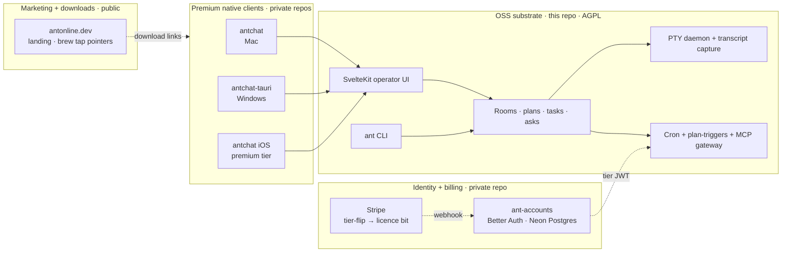

# ANT — Agent-Native Terminal

> ⚡ A self-hosted operator console for the AI agents you actually keep around.
> Multi-CLI, multi-model, multi-agent — running on your hardware, on your network, with the substrate (memory, plans, rooms, identity) as the durable part and the model behind each agent as the muscle.

ANT is for operators who run more than one CLI agent at once — Claude Code, Codex, Gemini, pi, Qwen, Copilot — and want them to share rooms, plans, decisions, and banked memory instead of starting from zero every session. The server in this repository is the open-source substrate. Native clients, hosted billing, and licence enforcement live in separate packages and are never required to run ANT.

The agent is the constant; the model behind it is interchangeable muscle. Substrate work compounds across sessions and across model swaps; model work does not.

---

## What people actually do with it

**Ship a feature with five agents in one room.**
Open a room, invite three Claude Code agents and a Codex agent, paste the brief, and step away. Each agent picks tasks off the shared plan, posts progress, reacts to each other's work, and raises an `ask_*` when blocked. The room is the unit of context — not the session — so when one agent hits its context window, the next picks up from the same plan, the same artefacts, and the same in-jokes. You stay out of the loop until the asks panel lights up.

**Hand a long job to an agent overnight.**
Spawn a terminal, attach a `@codex` or `@coordinator`, hand off a brief, and close the laptop. ANT keeps the PTY alive, captures the transcript, fires cron jobs against the plan, posts webhooks when tasks flip to `done`, and surfaces an ask on your phone if the agent needs you. Wake up, open the dashboard, read the asks panel, accept the PR. The agent remembers what it did, who told it to do it, and what last week's tradeoff was.

**Route work to the cheapest model that can do it.**
Claude Code for judgement-heavy reasoning, Codex for code, Gemini for multimodal, Qwen or GLM for cheap parallel sweeps, pi for local-machine work. Every agent row in ANT shows its model, provider, cost tier, and tokens used in the session — so when the router picks the cheap model you see why, and when it escalates to the expensive one you see why too. A continuous low-cost agent watches the room all day for the price of a coffee; the expensive models only fire when the work warrants them.

---

## Quick start

```sh
git clone https://github.com/Jktfe/a-nice-terminal.git
cd a-nice-terminal
npm install
cp .env.example .env       # then edit the demo credentials and tokens
npm run build && npm run start
```

The web UI is on `http://localhost:6174`. Add the CLI on macOS via Homebrew:

```sh
brew install jktfe/antchat/ant
ant register --handle @you
```

For HTTPS access from another device, the simplest path is `tailscale serve https / http://localhost:6174` — Tailscale terminates TLS on port 443 and proxies through to the local service.

---

## Architecture in 60 seconds

ANT is a four-layer system. Only the bottom layer is in this repository; everything else is optional from the substrate's point of view.



The OSS substrate runs entirely on the operator's own infrastructure — your Mac mini, your home server, your cloud box. There is no phone-home, no telemetry sent off-host, no "free tier" dark pattern. "No token = free tier" is the default code path (Architectural Invariant #1).

---

## Where things live

| Repository | Visibility | Purpose |
|---|---|---|
| [`Jktfe/a-nice-terminal`](https://github.com/Jktfe/a-nice-terminal) | **Public · AGPL-3.0** | This repo. SvelteKit operator UI, `ant` CLI, multi-CLI integration matrix, rooms + plans + tasks + asks + terminals + cron, audit harnesses. |
| `Jktfe/antchat` | Private | Premium native Mac chat client. Connects to a local or remote ANT substrate over the documented HTTP API. |
| `Jktfe/ant-accounts` | Private | Identity, billing, and licence service backing `accounts.antonline.dev`. Better Auth + Neon Postgres + Stripe webhook → tier-flip → MCP gateway licence bit. Optional from the substrate's POV. |
| [`Jktfe/antonline-dev`](https://github.com/Jktfe/antonline-dev) | Public | Marketing site and downloads landing at antonline.dev. Release notes, install instructions, screenshots. |
| [`Jktfe/homebrew-antchat`](https://github.com/Jktfe/homebrew-antchat) | Public | Homebrew tap. Publishes the `ant` CLI binary signed-by-SHA from each tagged release. |

---

## What's in this repository

- **SvelteKit operator UI** — dashboard, rooms, plans, Gantt, tasks, asks, decks, artefacts, terminals, manual canvas, vault, agents board, cron page. Tauri thin-client shell wraps the same UI for Mac and Windows native windows.
- **`ant` CLI** — 40+ verbs covering chat, plan, task, room, terminal, deck, ask, flag, hook, memory, doc, share, register, identity, remote, router, screenshot, tunnel, voice, fingerprint and more. Live discovery via `GET /api/cli/discover`; manifest at `src/lib/cli-manifest/manifest.ts`.
- **Multi-CLI integration matrix** — per-CLI transcript-tail watchers, statusline contracts, and `ant hooks doctor` for one-command health checks against hardcoded URLs, stale ports, and template drift.
- **Cron primitive + plan triggers** — operator-defined recurring jobs and event-driven dispatch over four action types (`room.message`, `console.log`, `webhook.post`, `task.create`) with SSRF guard on outbound webhooks.
- **Browser-session auth + identity gate** — 30-day default TTL, Path=/ cookie scoping, same-origin Origin-header check, optional demo-login env-gate, three CI regression harnesses (auth-bypass, spoof-target, server-down graceful-degradation).
- **PTY-inject + transcript capture** — ANT can post into any attached terminal and read its transcript back, so agents reply where you are working.

What is **not** in this repository and never required to run it: premium native iOS / Android apps, managed hosted services, verification-policy workflows, paid SaaS dependencies.

---

## Status

**Phase 1 shipped 2026-05-20.** End-to-end Stripe → tier-flip → MCP gateway licence bit is live; Mac antchat is distributed via Homebrew tap; OSS server publishes to `Jktfe/a-nice-terminal` under AGPL.

| Gate | State |
|---|---|
| Unauth bypass audit (`scripts/audit-auth-gates.sh`) | 9 / 9 PASS |
| Spoof-target audit (`scripts/audit-auth-target-gaps.sh`) | 5 / 5 PASS |
| Server-down graceful-degradation (`scripts/audit-server-down-fallback.sh`) | 7 / 7 PASS |
| Vitest regression | 3 671 / 3 671 PASS |
| Stripe → tier-flip → MCP gateway licence bit | End-to-end live on `accounts.antonline.dev` |
| Homebrew distribution (`brew install jktfe/antchat/ant`) | Live |
| Windows MSI via Scoop | Live (unsigned, SHA256-verified) |

See [`docs/launch-readiness-2026-05-20.md`](./docs/launch-readiness-2026-05-20.md) for the live status board and [`CHANGELOG.md`](./CHANGELOG.md) for the full 0.1.0 changelog. Phase 2 (hardware-binding) and Phase 3 (cross-device room-sync) are on the roadmap.

---

## Tiers

| SKU | Price | Per | What you get |
|---|---|---|---|
| **OSS antOS self-host** | £0 | — | Full server, web UI, CLI, multi-CLI hooks, plans, rooms, asks. Forever free. |
| **antchat** | £6/mo | Human | Native Mac + Windows chat client. Unlimited installs. Bundles MCP gateway. |
| **antios** | £6/mo | Human | Native iOS app (iPhone + iPad). |
| **antchat + antios bundle** | £10/mo | Human | Default for both-platforms users. |
| **antOS native server** | £10/mo | Instance | Managed native server app (skip the self-host setup). Each running server is one licence. |
| **antOS native + antios server-app bundle** | £15/mo | Instance | Server host + mobile admin companion. |
| **Enterprise hosting** | bespoke | — | ANT-set-up-for-you. Future. |

Pricing axes: **per-Human** for client apps, **per-Instance** for server apps. Self-hosting is a first-class citizen — the OSS path is celebrated, not tolerated.

---

## Install

### macOS — Homebrew

```sh
brew install jktfe/antchat/ant
```

### Windows — Scoop

```powershell
scoop bucket add antchat https://github.com/Jktfe/scoop-antchat
scoop install antchat-tauri
scoop update antchat-tauri
```

The first run opens a sign-in page. Use **Team Login** (email + password + licence key) or **Invite Token** (server URL + room ID + token) depending on how your operator provisioned access.

### Anywhere — from source

```sh
git clone https://github.com/Jktfe/a-nice-terminal.git
cd a-nice-terminal
npm install && npm run build && npm run start
```

For paid features (subscription, licence-bundle propagation, device management), point clients at [accounts.antonline.dev](https://accounts.antonline.dev).

---

## Configuration

Copy `.env.example` to `.env` for local development. Never commit real tokens, database files, launchd plists with secrets, local MCP files, or generated runtime snapshots.

Key variables:

- `ANT_API_KEY` / `ANT_ADMIN_TOKEN` — admin bearer secret for privileged routes.
- `ANT_FRESH_DB_PATH` — optional SQLite database path.
- `ANT_OPERATIONAL_RETENTION_DAYS` / `ANT_OPERATIONAL_RETENTION_MAX_DB_BYTES` — operational telemetry retention window and WAL threshold that triggers automatic prune + vacuum.
- `HOST` / `PORT` — bind address and port for production serving (default port `6174`).
- `ANT_DEMO_EMAIL` / `ANT_DEMO_PASSWORD` — optional, enables the demo-login gate on `/login`. **Change these before exposing the server to anyone but yourself.** Unset both to disable the gate entirely (anonymous walk-in resumes).
- `ANT_WEBHOOK_ALLOW_PRIVATE` — set to `true` to let cron `webhook.post` jobs target private / loopback / metadata IPs. Default fails closed (SSRF guard).

Full reference in [`.env.example`](./.env.example).

---

## Development

```sh
npm install
npm run dev        # vite dev on http://127.0.0.1:6174
npm run check      # svelte-kit sync + svelte-check
npm run test       # vitest
npm run build      # adapter-node production build
npm run start      # node scripts/start-snapshot.mjs (production)
```

Style and contribution bar are documented in [`STYLE.md`](./STYLE.md) — the **9-year-old-readable code bar** and **accessible-English prose bar** are non-negotiable. Svelte components and route files stay under 260 lines; copied code from the legacy `a-nice-terminal` lineage carries a `Copied-from:` audit note.

---

## Security

Security policy and reporting route are in [`SECURITY.md`](./SECURITY.md). Three regression harnesses run in CI and can be invoked locally:

```sh
bash scripts/audit-auth-gates.sh           # auth bypass class
bash scripts/audit-auth-target-gaps.sh     # spoof-target class
bash scripts/audit-server-down-fallback.sh # CLI degrades gracefully when ANT is down
```

`ant hooks doctor` is a one-command pre-deployment health check of every CLI hook directory on the operator's box (hardcoded URLs, stale ports, template drift).

---

## Links

- Website + downloads: [antonline.dev](https://antonline.dev)
- Accounts and billing (premium tiers): [accounts.antonline.dev](https://accounts.antonline.dev)
- Homebrew tap: [`Jktfe/homebrew-antchat`](https://github.com/Jktfe/homebrew-antchat)
- Positioning: [`POSITIONING.md`](./POSITIONING.md)
- Public release checklist: [`docs/oss-public-release-checklist.md`](./docs/oss-public-release-checklist.md)
- Issue templates: [`.github/ISSUE_TEMPLATE/`](./.github/ISSUE_TEMPLATE/)

---

## Licence

ANT is dual-licensed.

- **Open-source** — [GNU Affero General Public License v3.0 or later](./LICENSE). If you modify ANT and make it available over a network, AGPL §13 requires that you offer the corresponding source code to users of that service. Self-hosted single-user, single-team, and personal use are fully covered by the AGPL.
- **Commercial** — see [`COMMERCIAL_LICENSE.md`](./COMMERCIAL_LICENSE.md) for the alternative licence covering hosted commercial SaaS, embedded-in-proprietary-product distribution, and closed-source mobile clients. Enquiries: **redacted@example.com**.

Attribution and third-party notices are in [`NOTICE`](./NOTICE).

---

## Contributing

- [`CONTRIBUTING.md`](./CONTRIBUTING.md) — pull-request flow plus the code-clarity and prose bars.
- [`CODE_OF_CONDUCT.md`](./CODE_OF_CONDUCT.md) — Contributor Covenant 2.1.
- [`CHANGELOG.md`](./CHANGELOG.md) — Keep-a-Changelog format, SemVer.
- Bugs and feature requests: GitHub Issues using the templates in [`.github/ISSUE_TEMPLATE/`](./.github/ISSUE_TEMPLATE/).
