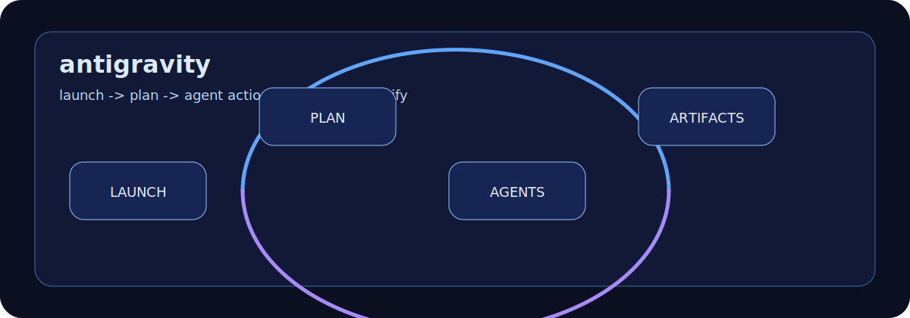

# ABOUT-ANTIGRAVITY

Google Antigravity is Google's agent-first development platform and CLI lane.
It is the right identity for this page: Gemini is model/platform context, but
Antigravity is the developer product being described.

## What It Is Good At

| Capability | What it means in a repo |
|---|---|
| Agent orchestration | Launch, monitor, and coordinate agent work instead of treating AI as a single editor autocomplete. |
| Multi-surface work | Let agents operate across editor, terminal, browser, and task artifacts. |
| Antigravity CLI continuity | Keep the critical Gemini CLI-style capabilities: skills, hooks, subagents, and extensions/plugins. |
| Artifact-backed work | Use plans, task lists, screenshots, recordings, and other artifacts as reviewable evidence. |
| Migration lane | Move Gemini CLI workflows toward the Antigravity CLI/platform direction. |

## How To Think About It

Antigravity should feel like mission control for agentic development. The page
should not say "Gemini" as the product identity. Say Antigravity, then describe
Gemini only when the underlying model or Google platform context matters.

## Good Fit

- Agent-managed feature work where planning, execution, and verification need
  to stay visible.
- Workflows that benefit from a manager view, artifacts, and multi-surface
  orchestration.
- Teams moving from Gemini CLI into the Antigravity CLI/platform lane.
- Coding work where the output needs artifact-backed review, not just a text
  answer.

## Poor Fit

- Pages that collapse Antigravity back into "Gemini CLI."
- Claims of one-to-one feature parity during the Gemini CLI transition.
- Agent autonomy without artifacts, review, and permission boundaries.
- Product claims not backed by current Google Antigravity sources.

## Source Notes

- Google describes Antigravity as an agentic development platform for the
  agent-first era: <https://antigravity.google/>
- The Antigravity CLI overview describes bringing reasoning, execution, and
  orchestration capabilities into the local shell:
  <https://antigravity.google/docs/cli-overview>
- Google's transition note says Antigravity CLI keeps critical Gemini CLI
  capabilities such as Agent Skills, Hooks, Subagents, and Extensions as
  plugins:
  <https://developers.googleblog.com/an-important-update-transitioning-gemini-cli-to-antigravity-cli/>
