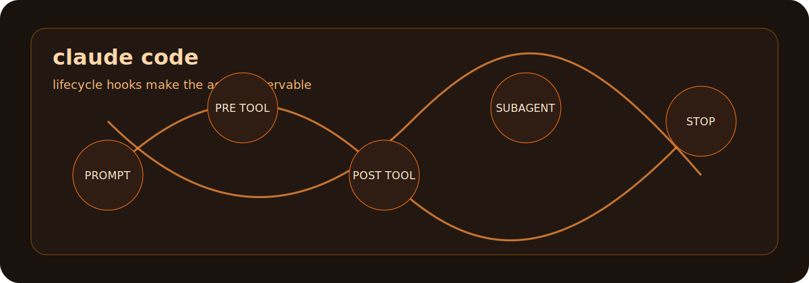

# ABOUT-CLAUDE-CODE

Claude Code is a coding agent CLI built for repository work. Its strongest
public capability is the depth of its lifecycle surface: commands, tools,
hooks, subagents, and project instructions can all become part of a visible
engineering loop.

## What It Is Good At

| Capability | What it means in a repo |
|---|---|
| Lifecycle hooks | Run shell commands, HTTP calls, or prompt hooks at known points in a session. |
| Deterministic guardrails | Use hook events to format, test, block, log, or enrich work without relying on memory. |
| Project-aware coding | Read repository instructions and work inside the local project context. |
| Subagent workflows | Delegate focused slices when a task benefits from parallel investigation or review. |
| Transcript-backed handoff | Keep enough session evidence for review, replay, and durable handoff. |

## How To Think About It

Claude Code is strongest when the repo has rules. Hooks make those rules active:
before a tool runs, after a tool returns, when a prompt arrives, when a session
starts, and when a turn stops.

That means a good Claude Code setup is not just a prompt. It is a small control
system around the agent.

## Good Fit

- Projects that need repeatable checks before changes land.
- Multi-step edits with a clear verification path.
- Documentation, migration, and refactor tasks with visible source evidence.
- Workflows where hooks should record status, block risky actions, or sync state.

## Poor Fit

- Repositories with no build, test, or review signal.
- Hidden side effects that bypass hooks or local commands.
- Claims about the model's private reasoning. Hooks expose events and tool I/O,
  not internal thoughts.

## Source Notes

- Claude Code's hook reference says hooks are commands, HTTP endpoints, or LLM prompts that run at specific lifecycle points and receive JSON event context: <https://code.claude.com/docs/en/hooks>
- The Claude Code CLI reference covers command-line usage, flags, interactive mode, tools, checkpointing, hooks, plugins, and channels: <https://code.claude.com/docs/en/cli-reference>

