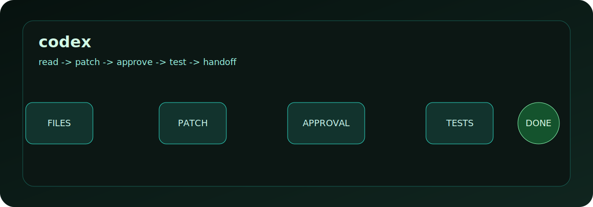

# ABOUT-CODEX-CLI

OpenAI Codex CLI is a terminal-native coding agent. It is useful when the work
is real repository work: reading files, editing code, running commands, checking
tests, and leaving a clear trail of what changed.

## What It Is Good At

| Capability | What it means in a repo |
|---|---|
| Local coding loop | Work from the project directory, inspect files, make patches, and verify with local commands. |
| Guided permissions | Use sandbox and approval modes so risky file, shell, or network actions are explicit. |
| Repository instructions | Follow project guidance from files such as `AGENTS.md` and local configuration. |
| Resume and review workflows | Continue prior work, review changes, and keep the operator in control of what lands. |
| Extensible tooling | Connect useful external tools where MCP or local integrations are configured. |

## How To Think About It

Codex CLI is not a magic commit machine. Treat it as a careful terminal pair
programmer:

1. Give it a concrete task and a real repository.
2. Let it read before it edits.
3. Keep approvals visible.
4. Require tests, build checks, or a human review before merge.

## Good Fit

- Fixing bugs with reproducible commands.
- Refactoring code where the expected behavior is clear.
- Creating tests for a known surface.
- Producing first-pass documentation from inspected code.
- Reviewing a diff for serious correctness risks.

## Poor Fit

- Unbounded product strategy without local evidence.
- Destructive cleanup without a clear target and approval.
- Claims about production behavior that have not been verified.
- Private or regulated data workflows without a security review.

## Source Notes

- OpenAI describes Codex CLI as a coding agent that runs locally in the terminal and can be installed with npm, Homebrew, native installers, or release binaries: <https://github.com/openai/codex>
- The Codex CLI reference documents interactive usage, sandbox flags, approval modes, image attachments, and live web search behavior: <https://developers.openai.com/codex/cli/reference>
- OpenAI's security guidance covers sandboxing, approvals, and network controls: <https://developers.openai.com/codex/agent-approvals-security>

