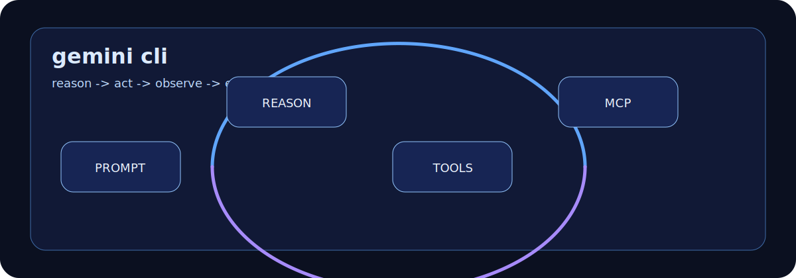

# ABOUT-GEMINI-CLI

Gemini CLI is Google's open source AI agent for the terminal. It is a strong fit
for developers who want a command-line route into Gemini models, local project
context, built-in tools, and MCP extensions.

## What It Is Good At

| Capability | What it means in a repo |
|---|---|
| Terminal-first access | Start from the shell and work directly against local project context. |
| ReAct-style loop | Reason, act with tools, inspect results, and continue until the task is resolved or blocked. |
| Built-in tools | Use file operations, shell commands, web fetching, and Google Search grounding where available. |
| MCP extension | Add external tools through local or remote MCP servers configured in `settings.json`. |
| Open source distribution | Inspect, install, and contribute through the public Gemini CLI repository. |

## How To Think About It

Gemini CLI is a practical workbench: prompt, inspect, act, verify. It is not only
for writing code; Google's documentation also frames it as useful for content
generation, problem solving, research, and task management.

## Good Fit

- Large-context code understanding.
- Bug fixes and feature work with local commands.
- Test coverage improvements.
- Research tasks that benefit from web grounding.
- Workflows that need MCP-backed tools.

## Poor Fit

- Work that needs guaranteed offline-only execution.
- Repositories where shell or file access cannot be safely granted.
- Enterprise data flows that have not been checked against your edition's privacy
  and compliance rules.

## Source Notes

- The Gemini CLI repository describes it as an open source agent that brings Gemini to the terminal, with built-in tools, MCP support, and an Apache 2.0 license: <https://github.com/google-gemini/gemini-cli>
- Google Cloud docs describe Gemini CLI as using a reason-and-act loop with built-in tools and local or remote MCP servers for tasks such as fixing bugs, creating features, and improving tests: <https://docs.cloud.google.com/gemini/docs/codeassist/gemini-cli>
- The Gemini CLI MCP docs describe configuring `mcpServers` in `settings.json`: <https://google-gemini.github.io/gemini-cli/docs/tools/mcp-server.html>

