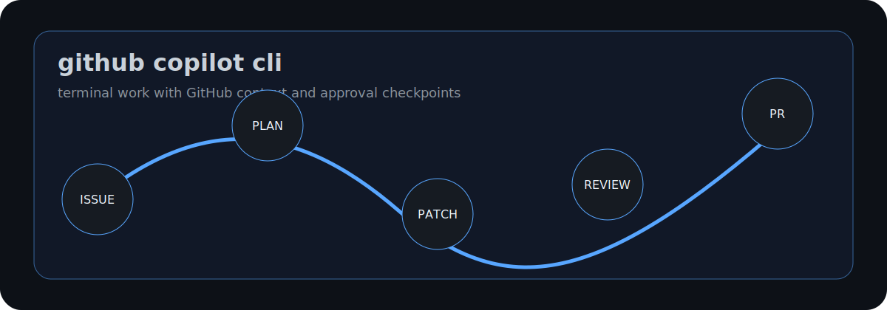

# ABOUT-GITHUB-COPILOT-CLI

GitHub Copilot CLI brings Copilot into the terminal. Its natural home is a real
repository with GitHub context, project instructions, local commands, and a
developer who wants to delegate work without leaving the shell.

## What It Is Good At

| Capability | What it means in a repo |
|---|---|
| Terminal chat and agent work | Ask questions or delegate coding tasks from the command line. |
| Trusted-directory model | Confirm whether Copilot may read, modify, and execute files in the current folder. |
| Tool approval prompts | Require approval before modifying or executing potentially risky commands. |
| GitHub-native context | Work with issues, pull requests, branches, and repository guidance. |
| Scheduling and resume | Use slash commands such as `/every`, `/after`, `/resume`, and continuation flows where available. |
| Custom instructions and skills | Use repo instructions, path-specific instructions, `AGENTS.md`, custom agents, and skills. |

## How To Think About It

Copilot CLI is a terminal route into GitHub-aware agent work. The approval model
matters: a useful session makes the agent's file and command access explicit
instead of pretending the terminal is risk-free.

## Good Fit

- GitHub issue and pull request work.
- Local bug fixing with approval checkpoints.
- Scheduled checks and recurring maintenance prompts.
- Repository tasks guided by `.github/copilot-instructions.md`, path-specific
  instructions, or `AGENTS.md`.

## Poor Fit

- Work outside a trusted folder.
- Tasks that require hidden credentials in prompts.
- Fully autonomous execution where the repository has no tests, checks, or review
  gate.

## Source Notes

- GitHub's Copilot CLI docs describe starting `copilot`, trusting the folder, approving tools that modify or execute files, scheduling prompts, resuming sessions, custom instructions, skills, and sandboxing: <https://docs.github.com/en/copilot/how-tos/copilot-cli/use-copilot-cli/overview>
- GitHub's product page describes Copilot CLI as a GitHub-native terminal agent that can work with issues, pull requests, plans, and parallelized subagents: <https://github.com/features/copilot/cli>

