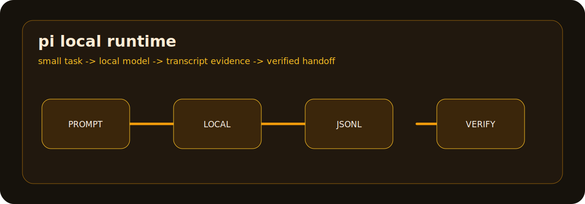

# ABOUT-PI-LOCAL

Pi local runtime is the local, small-context lane: an ANT-friendly shell harness
for running local or locally-routed models through tools such as Ollama. It is
not a single vendor CLI in the same way as Codex, Claude Code, Antigravity,
Copilot CLI, or Qwen Code. Treat it as a local runtime pattern.

## What It Is Good At

| Capability | What it means in a repo |
|---|---|
| Local model execution | Run supported models in a developer-controlled environment through a local runtime. |
| Privacy-aware loops | Keep suitable prompts and outputs local when the selected model and runtime support it. |
| Fast constrained work | Handle small, well-scoped tasks where shorter context and lower latency matter. |
| Adapter-friendly telemetry | Project transcript, usage, and terminal events into the same evidence model as cloud CLIs. |
| Model flexibility | Swap the model underneath without changing the surrounding workflow discipline. |

## How To Think About It

Pi is a runtime lane, not a universal replacement for large cloud coding agents.
The right job is narrow, inspectable, and easy to verify:

1. Give it a small task.
2. Keep the repo evidence close.
3. Record transcript and terminal events.
4. Escalate to a larger CLI when the task needs broad context or deeper review.

## Good Fit

- Local checks and small patches.
- Sensitive or offline-friendly experiments, subject to your model/runtime setup.
- Fast triage and summarization.
- Transcript-adapter development where the repo wants one evidence format across
  many CLIs.

## Poor Fit

- Large refactors that need a very broad repository view.
- Claims that all data stays local when the selected model or wrapper actually
  calls a remote service.
- Safety-critical coding without a separate review gate.

## Source Notes

- Ollama's CLI reference documents running models and launching integrations from the terminal: <https://docs.ollama.com/cli>
- Google's Gemma with Ollama guide documents setting up Ollama to run Gemma models locally: <https://ai.google.dev/gemma/docs/integrations/ollama>
- The existing ANT Task 1 Pi page is local project evidence for the visual and operating style: `static/pi-about.html`
