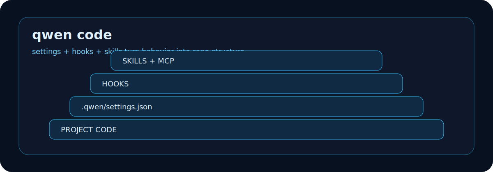

# ABOUT-QWEN-CODE

Qwen Code is an open source coding agent CLI optimized for Qwen models. It is
designed for terminal-based code understanding, editing, automation, and
workflow customization through settings, hooks, skills, and MCP.

## What It Is Good At

| Capability | What it means in a repo |
|---|---|
| Configurable CLI behavior | Use settings files, environment variables, and CLI arguments with clear precedence. |
| Project-local setup | Store project settings and skills under `.qwen/` so behavior can follow the repo. |
| Hooks | Run custom scripts at lifecycle points such as session start, before and after tool use, and session end. |
| Skills | Package reusable task instructions and resources under `.qwen/skills/`. |
| MCP tools | Connect Qwen Code to external data sources and tools through MCP servers. |

## How To Think About It

Qwen Code is strongest when the repo treats agent behavior as configuration, not
folklore. The useful pattern is:

1. Put shared project behavior in `.qwen/settings.json`.
2. Put reusable capabilities in `.qwen/skills/`.
3. Use hooks for observable lifecycle events.
4. Use MCP for external tools that should not be pasted by hand.

## Good Fit

- Large codebase reading and focused edits.
- Repo-specific automation that should be versioned.
- Coding workflows where hooks can record, check, or stop events.
- Teams that want model-provider and environment settings to be explicit.

## Poor Fit

- Repos where no local settings should be committed.
- Workflows that depend on undocumented private model behavior.
- Claims about status unless backed by a hook, transcript, or terminal event.

## Source Notes

- Qwen Code's configuration docs describe settings precedence, settings file locations, environment variables, command-line arguments, project `.qwen/` files, and `.qwen/skills/`: <https://qwenlm.github.io/qwen-code-docs/en/users/configuration/settings/>
- Qwen Code's hooks docs describe lifecycle hooks, enabled-by-default behavior, and `disableAllHooks`: <https://qwenlm.github.io/qwen-code-docs/en/users/features/hooks/>
- Qwen's product page describes Qwen Code as an open source terminal agent optimized for Qwen models: <https://qwen.ai/qwencode>

