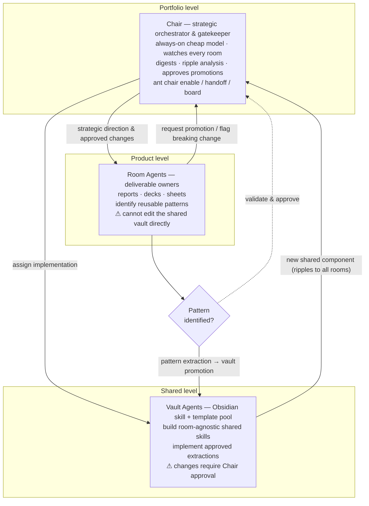
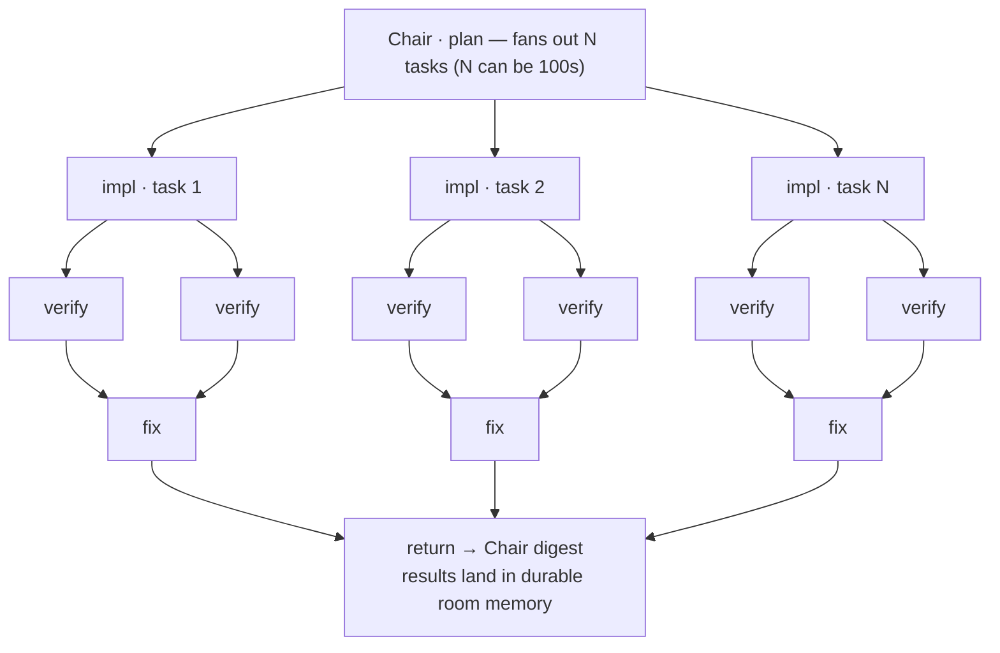

# ANT Agent Cluster Workflow — recreation, UI-TARS / tiny-router research, and improvement backlog — 2026-05-31

Author: @claude (branch `claude/ant-ui-automation-research-WEMa0`)
Status: research + design sketch (no production code changed)
Artifact: [`agents-pitch/agent-cluster-workflow-dark.html`](../agents-pitch/agent-cluster-workflow-dark.html)

## Why

Two reference diagrams were circulated — Adrian Murray's **"AI Agent Cluster Workflow"**
(a Co-CTO orchestrator/gatekeeper sitting above App agents and Framework agents, with a
"Pattern Identified?" routing gate and a "Handoff Protocol: Accomplished / Pending /
Blockers") and a second **"Agent Teams / Dynamic Workflows"** panel (a peer agent triad,
plus an orchestrator that fans out N tasks → implementer → verifiers → fixer → returns
when done).

This doc does three things:

1. **Recreates** those diagrams in the context of how **ANT** (`a-nice-terminal`) already
   works, using ANT's real vocabulary.
2. **Researches** [`bytedance/UI-TARS-desktop`](https://github.com/bytedance/UI-TARS-desktop)
   and [`UdaraJay/tiny-router`](https://github.com/UdaraJay/tiny-router).
3. Proposes **concrete improvements** to ANT, written up as an **actionable backlog** in
   ANT's own plan / task / ask vocabulary.

The pattern maps onto ANT unusually cleanly because ANT already ships most of the moving
parts: **rooms** (not sessions) are the unit of context; there are **plans, tasks, and
asks**; memory is **durable and DB-backed** ("14-day flow", context held ~25–35%); there
is a **Cross-Agent Inbox**, **PTY-inject + transcript capture**, an **MCP gateway**, and an
already-shipped **Chair** plug-in — an always-on cheap-model agent that watches every room,
produces a per-room digest, and supports `ant chair enable/disable/handoff/board`
(see [`docs/m4-4-chair-handoff-design-2026-05-14.md`](./m4-4-chair-handoff-design-2026-05-14.md)).

One important constraint flows from that same Chair design doc: **model routing is a
deliberately deferred lane** (`ant-no-model-router-no-chairman`). The tiny-router research
below is relevant — but it must be framed as *signal routing* (triage, retention,
follow-up detection), **not** as a model-selection chairman. That framing is load-bearing
in the recommendations.

## 1 · Recreation — the cluster mapped onto ANT

| Reference concept | ANT equivalent |
|---|---|
| **Co-CTO Agent** — portfolio orchestrator & gatekeeper | **Chair** (always-on cheap-model per-room watcher/digest + `chair handoff`); extended here to a **Portfolio Chair** spanning rooms |
| **App Agents** — product feature devs, restricted from the shared framework | **Room agents** owning deliverables (reports, decks, sheets); cannot edit the shared vault directly |
| **Framework Agents** — shared-component maintainers, changes need approval | **Vault agents** — Obsidian skill + template pool maintainers; changes gated by the Chair |
| **"Pattern Identified?"** decision diamond / Pattern Extraction | **Routing/classification gate** (today: auto-classify-on-create + capability negotiation) — a candidate home for a tiny-router-style signal classifier |
| **Handoff Protocol** — Accomplished / Pending / Blockers (context preservation) | **`ant chair handoff`** + durable room memory; **Blockers → asks** raised into the **Cross-Agent Inbox**, resolved by an idle agent |
| **Agent Teams** (peer claude↔claude↔claude triad) | Peer **room agents** of different kinds (claude / codex / gemini / ollama / copilot / qwen) cross-checking each other |
| **Dynamic Workflows** (kick off N tasks → implementer → verifiers → fixer → return) | **Plan → task fan-out** over PTY terminals; cross-verification; a **fixer** loop; results return to the **Chair digest** rather than a lossy session |

### Panel A — cluster topology & the routing gate



**Handoff Protocol (context preservation)** — in ANT this is not a convention an agent has
to remember, it is substrate behaviour:

- ✅ **Accomplished** → written to durable room memory + the Chair digest.
- ⏳ **Pending** → next in queue; survives the session, so it is not lost when a context
  window fills (the "14-day flow" pillar).
- 🚧 **Blockers** → raised as **asks** into the Cross-Agent Inbox; an idle agent with the
  right access resolves them autonomously.
- `ant chair handoff <room> --to @handle` re-seats the chair with full context intact.

### Panel B — agent teams & dynamic workflows



The peer-triad ("Agent Teams") view is simply several room agents of different kinds in one
room cross-checking each other; the fan-out ("Dynamic Workflows") view is an ANT **plan**
expanding into **tasks** dispatched over the PTY daemon, with verify/fix as room-peer roles
and a single return path into the Chair digest. The styled two-panel version lives in
[`agents-pitch/agent-cluster-workflow-dark.html`](../agents-pitch/agent-cluster-workflow-dark.html).

## 2 · Research

### 2.1 `bytedance/UI-TARS-desktop`

A native **GUI Agent** stack (part of "TARS\*", alongside Agent TARS). TypeScript Turbo /
pnpm monorepo; built on the UI-TARS vision-language model + Seed-VL series. Operates a
computer/browser from natural language via a perception → understanding → action loop
(screenshot → VLM → mouse/keyboard), with Local, Remote, and Browser operator modes and a
hybrid GUI + DOM browser strategy. Takeaways relevant to ANT:

- **Event Stream Protocol / Agent Event Stream** — a typed event stream carries the agent's
  real-time state, tool calls, intermediate results, and final answers. External UIs
  *subscribe* to it (the Web UI is developed independently and talks to the server purely
  over this protocol), and v0.3.0 ships an **Event Stream Viewer** for data-flow tracking
  and debugging. Context engineering is built *from* this stream.
- **GUI / Browser Operator agent** — vision-grounded computer use, optionally fused with
  DOM control.
- **MCP server mounting** — the kernel is built on MCP and can mount MCP servers to reach
  real-world tools.

Sources: <https://github.com/bytedance/UI-TARS-desktop>,
<https://agent-tars.com/blog/2025-06-25-introducing-agent-tars-beta>,
<https://deepwiki.com/bytedance/UI-TARS-desktop>.

### 2.2 `UdaraJay/tiny-router`

A compact, experimental **multi-head text classifier** for short, domain-neutral routing
decisions. Python / HuggingFace Transformers, default encoder `microsoft/deberta-v3-small`
(lighter encoders supported), **ONNX-exportable with quantization** (edge/local intent).
Given the current message + optional interaction history it emits four calibrated heads:

| Head | Values | Use |
|---|---|---|
| `relation_to_previous` | new · follow_up · correction · confirmation · cancellation · closure | update existing state instead of treating every message as fresh |
| `actionability` | none · review · act | **the first routing gate** — skip / escalate to human / auto-execute |
| `retention` | ephemeral · useful · remember | manage what enters durable memory / the context window |
| `urgency` | low · medium · high | queue prioritisation |

Later heads receive a learned summary of earlier heads (e.g. `correction → act`).
Post-hoc temperature scaling calibrates the confidences.

Sources: <https://github.com/UdaraJay/tiny-router>,
<https://raw.githubusercontent.com/UdaraJay/tiny-router/main/README.md>.

## 3 · Improvement recommendations for ANT

Each is tied to a finding above and respects ANT's existing architecture.

1. **Typed Agent Event Stream** *(from UI-TARS)* — today ANT captures terminal transcripts
   as text (PTY tail). UI-TARS's lesson is that a *typed* event stream (state · tool call ·
   intermediate result · final answer) is a better substrate: the operator UI, the
   Cross-Agent Inbox, and the Chair digest all become *subscribers* rather than transcript
   scrapers, and you get replay + an Event Stream Viewer + richer evidence cards for free.
   This deepens, rather than replaces, the existing transcript capture.

2. **`operator` agent kind — GUI / Browser operator** *(from UI-TARS)* — ANT agents are
   CLI/PTY today. A UI-TARS-style vision+DOM computer-use agent kind, mounted through the
   existing **MCP gateway**, would let a room agent do real GUI work (fill web forms, build
   a deck, verify a live web page) — a natural fit for ANT's deliverable-centric framing.
   Extend the agent-kind model in `src/lib/stores/agentKinds.svelte.ts` (and its mirror
   `modelKinds.svelte.ts`).

3. **Local signal-router for triage & retention** *(from tiny-router)* — a compact,
   locally-run (ONNX) multi-head classifier feeding three substrate decisions ANT already
   makes implicitly:
   - **Inbox triage** — `urgency` + `actionability` gate which asks auto-resolve vs
     escalate to a human, turning the Cross-Agent Inbox from a flat queue into a
     prioritised one.
   - **Memory retention policy** — the `retention` head (ephemeral / useful / remember)
     decides what is written into durable 14-day memory, directly serving the "context held
     ~25–35%" pillar.
   - **Message routing** — `relation_to_previous` (new vs follow_up vs correction) lets an
     agent *update existing state* instead of spawning a fresh task.
   Running locally fits ANT's "local for routine sweeps, reserve cloud for deep judgment"
   cost-tier philosophy. **Critical framing:** scope this strictly as a *signal / triage*
   router, **NOT** model selection — explicitly honouring the deferred
   `ant-no-model-router-no-chairman` decision recorded in the Chair design contract.

4. **Portfolio Chair + ripple analysis** *(synthesis of the reference pattern)* — extend the
   per-room Chair into a cross-room orchestrator that performs the reference image's "ripple
   analysis" when a shared vault template/skill changes, and that gates promotion of a room
   pattern into the shared pool. This is the missing edge between the per-room Chair ANT
   ships today and the portfolio-level Co-CTO in the diagram.

## 4 · Actionable backlog (ANT plan / task / ask vocabulary)

Design-contract stubs, ready for an ANT agent to pick up. Each names a proposed CLI surface,
scope IN/OUT, and the source files it would touch. These are *proposals*, not commitments.

### DC-1 · `ant events` — typed agent event stream + Event Stream Viewer
- **Surface:** `ant events tail <room>`, `ant events viewer`; server emits typed events
  (`agent.state`, `tool.call`, `tool.result`, `message.final`).
- **IN:** typed event schema; subscriber API for UI / Inbox / Chair digest; replay.
- **OUT:** removing existing transcript capture (this wraps and enriches it, not replaces).
- **Touches:** PTY daemon + transcript capture layer; operator UI event consumers.
- **As an ANT plan:** one plan → tasks for schema, emitter, subscriber API, viewer page.

### DC-2 · `operator` agent kind via the MCP gateway
- **Surface:** new agent kind `operator` selectable alongside claude/codex/gemini/…; backed
  by a UI-TARS-style vision+DOM MCP server mounted on the gateway.
- **IN:** agent-kind registration; MCP mount; capability advertisement; evidence capture
  (screenshots already supported via `ant screenshot`).
- **OUT:** shipping/maintaining the VLM itself — mount an external operator, don't host it.
- **Touches:** `src/lib/stores/agentKinds.svelte.ts`, `modelKinds.svelte.ts`, MCP gateway.

### DC-3 · `ant router` — local signal classifier (triage + retention)
- **Surface:** `ant router classify <text>` → `{relation_to_previous, actionability,
  retention, urgency}` with calibrated confidences; consumed by Inbox triage + the
  memory-write path.
- **IN:** local/ONNX multi-head classifier (tiny-router shape); Inbox urgency+actionability
  gate; retention-driven memory-write policy; follow-up/correction state-update routing.
- **OUT (hard line):** model selection / "which LLM answers" — explicitly *not* in scope,
  per `ant-no-model-router-no-chairman`. This routes *signals*, not models.
- **Touches:** Cross-Agent Inbox / asks; durable-memory write path; existing `ant router`
  CLI verb (extend, don't redefine).

### DC-4 · Portfolio Chair + shared-template promotion gate
- **Surface:** `ant chair board --portfolio` (cross-room digest); a promotion gate when a
  room pattern is proposed for the shared vault, with ripple analysis across rooms.
- **IN:** cross-room aggregation of per-room digests; promotion-request → Chair-approval
  flow; ripple report ("which rooms does this shared-template change touch?").
- **OUT:** per-room chair scoping changes (separate contract, per M4.4 Q1).
- **Touches:** `chairStore` / `chairEnabledStore` + `/api/chair*` routes; vault/template
  surface.

## 5 · Verification

- **HTML artifact:** opened `agents-pitch/agent-cluster-workflow-dark.html` headless
  (`/opt/pw-browsers` Chromium) at 1200×2000 and confirmed both panels render in the house
  dark style (Geist / JetBrains Mono, `--ink-900`, agent colour tokens), with the routing
  gate, edge labels, Handoff legend (Panel A) and the peer triad + fan-out tree (Panel B).
- **Mermaid:** both fenced ```mermaid``` blocks above use standard `flowchart` syntax
  matching the README convention; render via GitHub markdown preview or
  `npx -y @mermaid-js/mermaid-cli`.
- **Self-consistency:** the doc uses only ANT vocabulary (rooms / plans / tasks / asks /
  Chair) and the tiny-router recommendation (DC-3) explicitly disclaims model selection.

## Notes

No production code is changed by this work item — the deliverables are this doc, the HTML
diagram, and the DC-1…DC-4 backlog. Any individual recommendation, if accepted, becomes its
own change with its own design contract.
