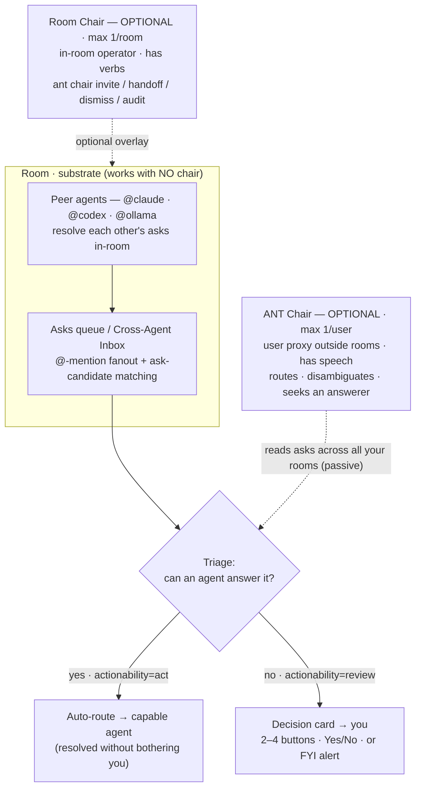
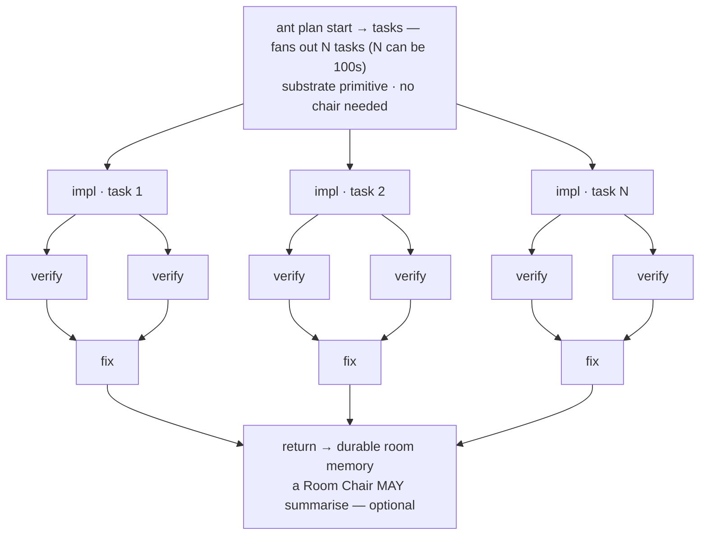

# ANT coordination & routing — cluster-pattern recreation, UI-TARS / tiny-router research, and improvement backlog — 2026-05-31

Author: @claude (branch `claude/ant-ui-automation-research-WEMa0`)
Status: research + design sketch (no production code changed)
Artifact: [`agents-pitch/agent-cluster-workflow-dark.html`](../agents-pitch/agent-cluster-workflow-dark.html)
Canonical reference: [`docs/concepts/ant-chair.md`](./concepts/ant-chair.md)

## Why (and a correction)

Two reference diagrams were circulated — Adrian Murray's **"AI Agent Cluster Workflow"**
(a Co-CTO orchestrator/gatekeeper above App agents and Framework agents, with a routing
gate and a Handoff Protocol) and an **"Agent Teams / Dynamic Workflows"** panel (a peer
triad, plus an orchestrator that fans out N tasks → implementer → verifiers → fixer →
returns).

A first pass mapped the Co-CTO onto a single, **mandatory** ANT "Chair." That was wrong on
the big picture, and this revision fixes it. Two corrections drive everything below:

1. **A Chair must never be required.** ANT's coordination is **substrate-first**: rooms,
   asks, @-mentions, tasks and the Cross-Agent Inbox carry the work, and peer agents resolve
   each other's asks with **zero chairs present**. A chair is an *overlay*, never a
   dependency. The single-mandatory-orchestrator shape in the reference image is precisely
   the pattern ANT avoids.
2. **"Chair" is two distinct primitives, not one** (canonical:
   [`docs/concepts/ant-chair.md`](./concepts/ant-chair.md)):
   - **Room Chair** — an *optional* in-room operator. Max 1/room, sits in the room as a
     member with `role:'chair'`, has **verbs** (move validation along, attach
     plans/artefacts, merge/dismiss asks, facilitate), owner-of-the-terminal pays.
     `ant chair invite / handoff / dismiss / audit`. `ant chair dismiss` returns a room to
     the no-chair state — proof the substrate runs chairless.
   - **ANT Chair** — an *optional* **user-focused** proxy. Max 1/user, lives **outside**
     rooms (top-level pane), has **speech**: it **routes, manages and disambiguates the
     user's tasks across all their rooms**, seeks out an agent that can answer
     autonomously, and presents cleaned-up **options with context** as plain-English
     decision cards. User's wallet pays; premium/opt-in.

The bulk of the cluster-workflow "facilitation / validation / handoff" learning belongs to
the **Room Chair**. The parts the first pass *missed* — **routing** and the **user
interface** — are the heart of the **ANT Chair**, and are where this revision adds depth.

## 1 · Recreation — the cluster, re-grounded on ANT

ANT does not have a portfolio gatekeeper. The corrected mapping:

| Reference concept | ANT equivalent |
|---|---|
| Single mandatory Co-CTO orchestrator | **Rejected.** Coordination is the substrate — rooms, asks, @-mentions, tasks, Inbox — and runs with **no chair** |
| App Agents / Framework Agents / peer triad | **Peer room agents** (claude/codex/gemini/ollama/…) resolving each other's asks in-room |
| Facilitation / validation / "ripple" / handoff | **Room Chair** — *optional* in-room operator with verbs (`ant chair invite/handoff/dismiss/audit`) |
| Routing gate + "present options" + escalate-to-human | **ANT Chair** — *optional* user proxy: triages the cross-room asks queue, auto-routes what an agent can answer, surfaces the rest as decision cards |
| Handoff Protocol — Accomplished / Pending / Blockers | **Substrate, not a chair**: durable room memory (Accomplished), persistent tasks + asks (Pending), ask-candidate routing then escalation (Blockers) |
| Dynamic-workflow orchestrator fanning out N tasks | **`ant plan start` → tasks** over the PTY daemon — a substrate primitive, no chair required |

### Panel A — optional chairs over a chairless substrate



### Panel B — dynamic workflows (no chair required)



The styled two-panel version lives in
[`agents-pitch/agent-cluster-workflow-dark.html`](../agents-pitch/agent-cluster-workflow-dark.html).

## 2 · Research

### 2.1 `bytedance/UI-TARS-desktop`

Native GUI Agent stack (TypeScript Turbo/pnpm monorepo; UI-TARS + Seed-VL models). Drives a
computer/browser from natural language via perception → understanding → action. Two ideas
matter for ANT:

- **Event Stream Protocol / Agent Event Stream** — a *typed* event stream (agent state, tool
  calls, intermediate results, final answers) that external UIs **subscribe** to (the Web UI
  is built independently and talks to the server purely over this protocol); ships an **Event
  Stream Viewer** for debug/replay; context engineering is built *from* the stream.
- **GUI / Browser Operator agent** — a vision+DOM computer-use agent that can complete real
  GUI tasks; mounts real-world tools via **MCP**.

Sources: <https://github.com/bytedance/UI-TARS-desktop>,
<https://agent-tars.com/blog/2025-06-25-introducing-agent-tars-beta>,
<https://deepwiki.com/bytedance/UI-TARS-desktop>.

### 2.2 `UdaraJay/tiny-router`

A compact **multi-head text classifier** for short, domain-neutral routing (Python /
Transformers, `deberta-v3-small`, **ONNX-exportable + quantizable** → local/edge). Given a
message + optional history it emits four calibrated heads:

| Head | Values | What it decides |
|---|---|---|
| `relation_to_previous` | new · follow_up · correction · confirmation · cancellation · closure | update existing state vs treat as a fresh request |
| `actionability` | none · review · act | **the first routing gate** — drop / surface to human / auto-execute |
| `retention` | ephemeral · useful · remember | what is worth keeping |
| `urgency` | low · medium · high | queue / inbox ordering |

Later heads receive a learned summary of earlier ones (e.g. `correction → act`); confidences
are temperature-calibrated. Sources: <https://github.com/UdaraJay/tiny-router>,
<https://raw.githubusercontent.com/UdaraJay/tiny-router/main/README.md>.

## 3 · Routing — what exists, and how to improve it

**Today (code-grounded):**

- `src/lib/server/pty-inject-fanout.ts` — outbound @-mention fanout (user/agent → terminal
  paste), handle-based.
- `src/lib/server/terminalReplyRouter.ts` — inbound agent stdout → linked chat room
  (debounce + noise-filter), closing the loop.
- `src/lib/server/askCandidateStore.ts` + `availabilityDigestStore.ts` +
  `agentVisibilityStore.ts` + `handleBindings.ts` — the seed of "who *could* answer this
  ask?" (candidate agents + availability/visibility).

So routing today is **handle / mention / availability** based. There is **no semantic
classifier** deciding whether an ask needs a human, how urgent it is, or whether it's a
follow-up to something already open.

**Improvement — an ANT Chair triage router (from tiny-router).** A compact, **locally-run**
(ONNX) multi-head classifier becomes the ANT Chair's triage engine. The four heads map
almost one-to-one onto decisions ANT already makes implicitly:

- `actionability` → **the gate**: `none` = FYI/drop; `review` = needs a user decision card;
  `act` = auto-route to a capable agent via `askCandidateStore` *before* bothering the user.
- `urgency` → orders the cross-room Inbox and drives the badge priority.
- `relation_to_previous` → **collapse** `follow_up` / `correction` / `confirmation` /
  `cancellation` into the **existing** decision thread instead of spawning a new card —
  "update existing state, don't treat every message as fresh." This directly kills duplicate
  decision cards, the worst inbox-noise failure mode.
- `retention` → what enters the user's decision log / durable memory (supports the "context
  held ~25–35%" pillar).

Pair the classifier's `act` verdict with a **capability+availability score** over
`askCandidateStore` / `availabilityDigestStore` so an ask routes to the *best idle* agent
automatically, and only escalates to the user when no agent can answer. Running locally fits
ANT's "local for routine sweeps, reserve cloud for deep judgment" cost philosophy.

> **Hard line (respecting `ant-no-model-router-no-chairman`):** this routes **asks and
> signals**, deciding *who/whether* — it does **not** pick which LLM answers. Model selection
> stays out of scope per the deferral recorded in
> [`docs/m4-4-chair-handoff-design-2026-05-14.md`](./m4-4-chair-handoff-design-2026-05-14.md).

## 4 · User interface — what exists, and how to improve it

**Today (code-grounded):** the surfaces are scaffolded but thin —
`src/lib/components/DecisionCard.svelte`, `AskCard.svelte`, `InteractiveAsksPanel.svelte`
(ANT Chair side); `ChairBoard.svelte`, `ChairRow.svelte`, `ChairRoomNotesPanel.svelte`
(Room Chair side); `AgentEventCard.svelte`, `MemoryHitCard.svelte`; routes
`src/routes/asks` and `src/routes/chair`; APIs `src/routes/api/asks`, `api/ask-candidates`,
`api/tasks`.

The canonical UX discipline for the ANT Chair is already written down
([`ant-chair.md`](./concepts/ant-chair.md)): **speech, not a digest** — decision cards with
2–4 buttons, Yes/No cards, or plain-English FYI alerts; *never* a technical leak ("does L9
come before F5") or a markdown wall. Improvements:

1. **Enforce speech-not-digest in `DecisionCard.svelte`.** A card states the user-decision in
   plain English + 2–4 button options; the technical detail collapses behind a "why?"
   disclosure. The badge counts only **actionable** items (`actionability=review`), not noise.
2. **Options *with context*.** Each option shows what it does and who/what it affects, pulled
   from room memory (click-to-explain), not the raw transcript — so the user decides without
   spelunking. e.g. *"3 claims on artefact X failed validation — (a) re-route to humans,
   (b) waive with note, (c) accept the lens result."*
3. **Urgency-ordered, thread-collapsed Inbox** (`InteractiveAsksPanel.svelte`) — driven by the
   §3 router: high-urgency first, follow-ups/corrections folded into one live thread instead
   of stacking duplicate cards.
4. **Live plain-English FYI alerts from a typed event stream** (UI-TARS lesson;
   `AgentEventCard.svelte` is the seed): *"I unblocked a terminal that was struggling with an
   MCP to reach Neon"* — an FYI that needs no action, rendered from a subscribable agent
   event stream rather than scraped from transcripts.

## 5 · Recommendations (each tied to a finding)

1. **ANT Chair triage router** *(tiny-router → routing)* — local multi-head classifier as the
   triage engine; auto-route `act`, surface `review`, collapse follow-ups, order by urgency.
   Signal routing only, **not** model selection.
2. **ANT Chair decision surface** *(UX → user interface)* — speech-not-digest decision cards,
   options-with-context, urgency/thread-collapsed Inbox, actionable-only badge.
3. **Typed agent event stream** *(UI-TARS → routing + UI)* — a subscribable typed stream that
   feeds live FYI alerts and decision-card context, plus a viewer/replay; deepens (not
   replaces) `terminalReplyRouter` transcript capture.
4. **`operator` agent kind** *(UI-TARS → routing)* — a vision+DOM computer-use agent mounted
   via the MCP gateway *widens the set of asks an agent can answer autonomously*, pushing more
   asks down the `act` path and fewer escalations to the user. Extend
   `src/lib/stores/agentKinds.svelte.ts`.

Underpinning all four: **chairs stay optional.** Every improvement degrades gracefully to the
chairless substrate — the router/UI live in the *opt-in* ANT Chair; the operator kind is just
another peer agent.

## 6 · Actionable backlog (ANT plan / task / ask vocabulary)

Design-contract stubs, ready for an ANT agent to pick up. Proposals, not commitments.

### DC-1 · `ant router` — local signal classifier feeding ANT Chair triage
- **Surface:** `ant router classify <text> [--history ...]` → `{relation_to_previous,
  actionability, retention, urgency}` + confidences; consumed by the ANT Chair triage path.
- **IN:** local/ONNX multi-head classifier (tiny-router shape); actionability gate
  (`act` → `askCandidateStore` auto-route; `review` → decision card; `none` → FYI/drop);
  urgency ordering; relation-based thread collapsing; retention → decision log.
- **OUT (hard line):** model selection / which LLM answers — explicitly excluded per
  `ant-no-model-router-no-chairman`. Routes signals, not models.
- **Touches:** `askCandidateStore.ts`, `availabilityDigestStore.ts`, `agentVisibilityStore.ts`,
  the asks/Inbox path; extends (not redefines) the routing layer.

### DC-2 · ANT Chair decision surface — speech, options-with-context, prioritised Inbox
- **Surface:** decision-card sheet + top-level nav slot + badge (per `ant-chair.md`);
  `ant chair inbox` / `ant chair decide <id> --option <o> --note "..."`.
- **IN:** enforce speech-not-digest in `DecisionCard.svelte`; options carry context
  (click-to-explain); urgency-ordered + thread-collapsed `InteractiveAsksPanel.svelte`;
  actionable-only badge count.
- **OUT:** Room Chair verb UI (separate surface); making the ANT Chair mandatory.
- **Touches:** `DecisionCard.svelte`, `AskCard.svelte`, `InteractiveAsksPanel.svelte`,
  `src/routes/asks`, `src/routes/chair`, `api/asks`, `api/ask-candidates`.

### DC-3 · Typed agent event stream + plain-English FYI alerts
- **Surface:** `ant events tail <room>` / viewer; typed events (`agent.state`, `tool.call`,
  `tool.result`, `message.final`) the UI/Inbox/ANT Chair subscribe to.
- **IN:** typed event schema; subscriber API; FYI-alert rendering (`AgentEventCard.svelte`);
  replay/viewer.
- **OUT:** removing transcript capture — this enriches `terminalReplyRouter`, not replaces it.
- **Touches:** PTY/transcript layer, `eventBroadcast.ts`, `AgentEventCard.svelte`.

### DC-4 · `operator` agent kind via the MCP gateway
- **Surface:** new agent kind `operator` (UI-TARS-style vision+DOM) selectable alongside
  claude/codex/…; mounted on the MCP gateway; evidence via existing `ant screenshot`.
- **IN:** agent-kind registration; MCP mount; capability advertisement so the router can route
  GUI-shaped asks to it.
- **OUT:** hosting the VLM — mount an external operator, don't host it.
- **Touches:** `src/lib/stores/agentKinds.svelte.ts`, `modelKinds.svelte.ts`, MCP gateway.

## 7 · Verification

- **HTML artifact:** rendered headless (`/opt/pw-browsers` Chromium, 1200×2050) — both panels
  render in the house dark style; Room Chair + ANT Chair show as dashed **OPTIONAL** overlays,
  the substrate core + "works with zero chairs" principle banner are present, and the triage
  gate branches to auto-route vs decision-card.
- **Mermaid:** both ```mermaid``` blocks validated with `@mermaid-js/mermaid-cli` (render OK).
- **Self-consistency:** mapping rejects the mandatory orchestrator; the two chairs are
  optional and distinct per `ant-chair.md`; the routing recommendation explicitly disclaims
  model selection; routing + UI sections cite real files that already exist.

## Notes

No production code is changed — deliverables are this doc, the HTML diagram, and the DC-1…DC-4
backlog. Each recommendation lives in the *opt-in* chair layer and degrades to the chairless
substrate; any one, if accepted, becomes its own change with its own design contract.
