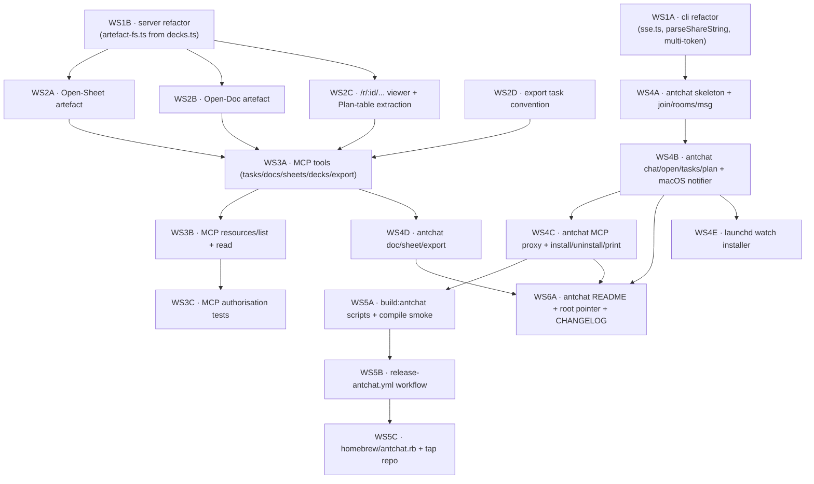

# ANTchat — swarm delivery plan

Companion to the approved ANTchat plan. Decomposes the work into workstreams
that map to ANT's existing `tasks/t-<id>` mempalace protocol
(see `docs/multi-agent-protocol.md`) so the delivery runs as a swarm rather
than a single-author sprint.

Roster you said is available:

- **Local**: your Claude Desktop / Code (the trusted reviewer + merge gate).
- **Cloud, available now**: DeepSeek, Qwen, GLM, Codex, Copilot, Antigravity.
- **Already wired in this repo**: Claude Code, Gemini CLI, Pi (RPC), Hermes
  (ACP), Ollama (local fallback for cheap mechanical work).

This doc only adds delivery coordination — no agent configuration changes
beyond the registry rows below.

## Roster registration

If `ant agents list` doesn't already include each handle below, run these
once before dispatching tasks. Each row captures `strengths`/`avoid` so the
verifier rule and "is this mine to do?" check work without you reciting it
every time.

```bash
ant memory put agents/deepseek '{
  "id":"deepseek","handle":"@deepseek","tier":"cloud",
  "strengths":["reasoning","code review","spec critique","verifier role"],
  "avoid":["UI work","Homebrew/launchd plumbing"],
  "reliability":0.85,"completed":0,"rejected":0
}'
ant memory put agents/qwen '{
  "id":"qwen","handle":"@qwen","tier":"cloud",
  "strengths":["mechanical refactor","renames","fixture generation","cheap throughput"],
  "avoid":["architectural decisions","cross-cutting auth"],
  "reliability":0.80,"completed":0,"rejected":0
}'
ant memory put agents/glm '{
  "id":"glm","handle":"@glm","tier":"cloud",
  "strengths":["markdown drafting","docs","structured generation","i18n-friendly"],
  "avoid":["TypeScript-heavy refactor"],
  "reliability":0.80,"completed":0,"rejected":0
}'
ant memory put agents/codex '{
  "id":"codex","handle":"@codex","tier":"cloud",
  "strengths":["pattern replication","do-this-twice scaffolding","TypeScript fluency"],
  "avoid":["novel auth design"],
  "reliability":0.85,"completed":0,"rejected":0
}'
ant memory put agents/copilot '{
  "id":"copilot","handle":"@copilot","tier":"cloud",
  "strengths":["unit tests","follow-the-pattern code","lint and CI fixes"],
  "avoid":["large refactors"],
  "reliability":0.85,"completed":0,"rejected":0
}'
ant memory put agents/antigravity '{
  "id":"antigravity","handle":"@antigravity","tier":"cloud",
  "strengths":["Svelte/SvelteKit pages","frontend components","CSS","viewer UX"],
  "avoid":["server-side auth"],
  "reliability":0.80,"completed":0,"rejected":0
}'
```

(Pi, Hermes, Gemini CLI, Claude Code, Ollama are assumed already registered.)

## Dependency graph



Wave 1 unblocks two parallel branches (WS2 server-side, WS4 client-side).
WS3 (MCP expansion) is the bridge: it depends on WS2 landing and unblocks
the full client feature surface (WS4D). Distribution (WS5) and docs (WS6)
trail.

## Wave 1 — refactor groundwork (parallel; both small)

| WS | Title | Assignee | Verifier | Done criteria |
|---|---|---|---|---|
| 1A | Extract `cli/lib/sse.ts`, export `parseShareString`, multi-token config | @claude-code | @copilot | `bun run check` 0/0; `bun run test` green; `ant chat join` round-trips against a live room. PR-seed already present on `claude/go-for-plan-WWkRG`. |
| 1B | Extract `src/lib/server/artefact-fs.ts` from `decks.ts` (no behaviour change) | @codex | @deepseek | Existing decks tests pass unchanged; `git diff src/lib/server/decks.ts` shows only re-imports of moved helpers. |

Dispatch:

```bash
ant memory put tasks/t-ws1a '{
  "title":"WS1A — cli/lib/sse.ts + parseShareString export + multi-token config",
  "status":"todo","delegator":"@james","assignee":"@claude-code","verifier":"@copilot",
  "done_criteria":"bun run check + test green; ant chat join round-trips; backward-compatible config read for single-token rooms",
  "links":["docs/antchat-swarm-plan.md#wave-1"]
}'
ant memory put tasks/t-ws1b '{
  "title":"WS1B — extract src/lib/server/artefact-fs.ts from decks.ts",
  "status":"todo","delegator":"@james","assignee":"@codex","verifier":"@deepseek",
  "done_criteria":"decks.ts now imports cleanDeckPath/assertInside/assertNoSymlinkSegments/assertSafeDeckSlug from artefact-fs.ts; no behaviour change; tests/decks-related cases unchanged",
  "links":["docs/antchat-swarm-plan.md#wave-1"]
}'
```

## Wave 2 — server artefacts (parallel after WS1B)

| WS | Title | Assignee | Verifier | Notes |
|---|---|---|---|---|
| 2A | Open-Sheet: `sheets.ts`, `sheets` table, `/api/sheets/...` routes, `/sheet/[slug]` viewer, tests | @codex | @copilot | Mirror of `decks.ts`. Env var `ANT_OPEN_SHEET_DIR` (default `~/CascadeProjects/ANT-Open-Sheet`). |
| 2B | Open-Doc: `word-docs.ts`, `word_docs` table, `/api/word-docs/...` routes, `/word-doc/[slug]` viewer, tests | @qwen | @copilot | Same shape as 2A; pattern is established by 2A so 2B is mechanical. |
| 2C | Per-room viewer gate — `deck-auth` → `requireArtefactAccess`; `/r/[id]/+layout.server.ts`; `/r/[id]/{plan,deck,doc,sheet}` pages; extract Plan-table component | @antigravity | @pi | Antigravity drives the Svelte pages. Pi verifies the routing/auth bridge. |
| 2D | Extend `/api/sessions/[id]/export/+server.ts` for `docx`/`xlsx` targets — write task, broadcast, no inline conversion | @qwen | @deepseek | Tiny: ~30 LOC + a test. |

Dispatch (template — repeat per WS):

```bash
ant memory put tasks/t-ws2a '{
  "title":"WS2A — Open-Sheet artefact (mirror of decks)",
  "status":"todo","delegator":"@james","assignee":"@codex","verifier":"@copilot",
  "depends_on":["tasks/t-ws1b"],
  "done_criteria":"bun run check + test green; tests/sheets.test.ts covers register/list/read/write + path-traversal + room-scope; viewer renders a markdown pipe-table",
  "links":["docs/antchat-swarm-plan.md#wave-2"]
}'
```

(Same shape for 2B, 2C, 2D — change `assignee`/`verifier`/`done_criteria`.)

## Wave 3 — MCP expansion (after Wave 2)

| WS | Title | Assignee | Verifier | Notes |
|---|---|---|---|---|
| 3A | Add MCP tools: `list_tasks`, `create_task`, `update_task`, `list_docs`, `read_doc`, `write_doc`, `list_sheets`, `read_sheet`, `write_sheet`, `list_deck_files`, `read_deck_file`, `request_export` | @claude-code | @codex | Cross-cutting; needs the auth refactor from WS2C in place. |
| 3B | Add MCP `resources/list` + `resources/read` for `ant-room://{roomId}/{kind}/{slug}/{path}` URIs | @deepseek | @claude-code | Smaller, well-scoped. |
| 3C | MCP authorisation tests — `kind ∈ {cli,mcp}` write rule, room-scope enforcement, revoked-token behaviour | @copilot | @hermes | Hermes runs `tests/integration/` against a live server. |

## Wave 4 — antchat client (starts after WS1A; full surface needs Wave 3)

| WS | Title | Assignee | Verifier | Notes |
|---|---|---|---|---|
| 4A | `antchat/` skeleton (package.json, index.ts, help) + `commands/{join,rooms,msg}.ts` | @claude-code | @copilot | Reuses `cli/lib/api.ts` + `cli/lib/config.ts` directly. |
| 4B | `commands/{chat,open,tasks,plan}.ts` + `lib/notifier.ts` (osascript on @mention) | @claude-code | @antigravity | Antigravity verifies UX/output formatting. |
| 4C | `lib/proxy.ts` (stdio MCP ↔ host /mcp/room/:id with SSE wake/route translation matching `notifications/claude/channel`) + `commands/mcp.ts` (serve/install/uninstall/print) + `lib/desktop-config.ts` | @claude-code | @deepseek | The subtlest piece — wake-on-targeted-mention is the design crux. |
| 4D | `commands/{doc,sheet,export}.ts` (gated on Wave 3 landing) | @codex | @copilot | Pattern follows 4B once MCP tools exist. |
| 4E | `commands/watch.ts install/uninstall` + `lib/launchd.ts` plist writer | @qwen | @pi | Uses macOS `launchctl bootstrap`. Opt-in only. |

## Wave 5 — distribution (after WS4C lands; ship binaries before docs)

| WS | Title | Assignee | Verifier | Notes |
|---|---|---|---|---|
| 5A | Root `package.json` build scripts: `build:antchat:arm64`, `build:antchat:x64` via `bun build --compile`; smoke that the binary runs `--help` on a Mac with no Bun installed | @gemini-cli | @copilot | Run on @james's Mac for the no-Bun smoke. |
| 5B | `.github/workflows/release-antchat.yml` — tag `antchat-v*` → matrix build (macos-14 arm64, macos-13 x64) → tar.gz → GitHub Release upload → emit SHA-256s to job summary | @gemini-cli | @pi | Borrow shape from existing `ci.yml`. |
| 5C | `homebrew/antchat.rb` (in-repo) + bootstrap of separate tap repo `Jktfe/homebrew-antchat`; first-cut formula references @james-supplied SHAs | @gemini-cli | @james | First release is manual; second tag drives the formula PR via `peter-evans/create-pull-request`. |

## Wave 6 — docs/release (last)

| WS | Title | Assignee | Verifier | Notes |
|---|---|---|---|---|
| 6A | `antchat/README.md` (brew install → join → mcp install), root README "ANTchat (lightweight client)" section, `CHANGELOG.md` row | @glm | @hermes | GLM drafts; Hermes runs the doc lint and end-to-end-from-clean smoke. |

## Coordination conventions

- **Where work lives**: each WS is one row in `tasks/t-ws<id>`. Update the
  row, don't shadow it elsewhere. Verifier reads the row's `evidence` array,
  not the chat narrative.
- **Plan-of-attack**: assignee posts a one-liner plan to the room before
  flipping `status: doing`, per `docs/multi-agent-protocol.md` §"Accepting
  a delegated task".
- **Evidence**: minimum row to flip `review`:
  - `commit_sha` from `git log -1 --format=%H`
  - `bun run check` and `bun run test` exit codes (paste tail of output)
  - For client work, `lsof` output proving the SSE connection count
    (one connection per token; non-negotiable per the no-poll guarantee).
- **Cross-WS @-mention**: address the **assignee** of the other WS, not the
  WS id. Example: `@codex blocked on tasks/t-ws2a — sheet table schema
  conflicts with decks idx; can you adjust?`.
- **Loop guard**: if a verifier rejects twice in a row, set
  `status: blocked, awaiting: @james`. Don't ping-pong.
- **Reliability updates**: verifier bumps `agents/<assignee>.reliability`
  on accept and `.rejected` on reject (one decimal place; ±0.01 per event).
  See `docs/multi-agent-protocol.md` §"Updating the registry".

## Pacing & parallelism

Realistic concurrency given verifier separation:

- **Wave 1**: 2 in-flight (WS1A on Claude, WS1B on Codex); separate verifiers.
- **Wave 2**: up to 4 in-flight (2A Codex / 2B Qwen / 2C Antigravity / 2D Qwen).
  Watch Qwen has two — sequence 2D after 2B or hand 2D to a fresh agent
  (Hermes can take it).
- **Wave 3**: 3 in-flight, but 3B depends on 3A's tool-shape decisions;
  prefer 3A → 3B sequential, 3C in parallel with 3B.
- **Wave 4**: 4A → 4B → 4C is mostly serial (Claude-driven). 4E (Qwen)
  parallels 4B. 4D waits on Wave 3.
- **Wave 5**: serial (5A → 5B → 5C), all Gemini-CLI.
- **Wave 6**: single task; runs after 5A binary smoke.

End-to-end critical path: WS1A → WS4A → WS4B → WS4C → WS5A → WS6A.
Server-side critical path: WS1B → WS2C → WS3A → WS4D.

## What @james does

- Approve registration rows (above) once.
- Paste the WS1A and WS1B `ant memory put tasks/t-...` blocks to kick off.
- Watch the room for `@james` mentions (loop guards, blocked rows, formula
  SHAs the release workflow needs).
- Merge PRs after the verifier flips `done`.

## Open questions for @james

1. Is there an existing tap repo `Jktfe/homebrew-antchat`, or do I create one
   as part of WS5C?
2. Confirm the colleague-facing handle naming convention — the plan assumes
   `@colleague` (human) and `@colleagues-claude` (agent). If you'd rather use
   `@external-<name>` or similar, say so before WS4C lands the proxy
   defaults.
3. Should the launchd watcher (WS4E) ship in the v0.1.0 release or wait for
   v0.2.0? The plan currently has it in 0.1.0 but it is opt-in, so deferring
   is cheap.
